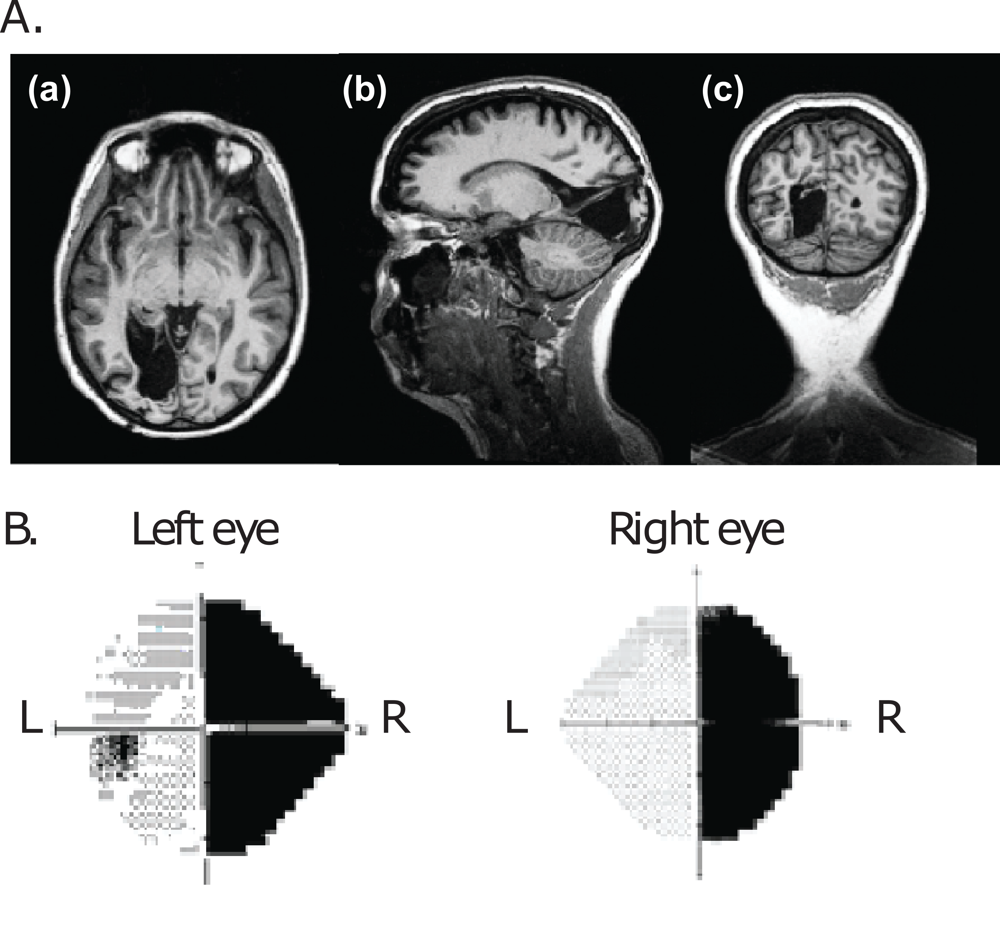

# mwmaclean-BHS2020
This project is part of the Brainhack School 2020

Team contributors: Michèle MacLean & Brainhack School members

## Summary 

 Hello! I'm currently a PhD student in Cognitive Neuroscience at l'Université de Montréal. I study cortical visual impairment and blindsight using MRI techniques.The overall goal of the current project is to become more proficient with tools to organize, analyze and visualize MRI data learned during the BrainHack Summer School. I'm very interested in working with a team or perhaps joining projects if possible! 

## Project definition 

### Background

This project will investigate the consequences of a primary visual cortex lesion on cerebral reorganization using magnetic resonance imaging, in particular diffusion MRI and/or resting state functional connectivity. For this, I will use previously acquired data from l'Unité de Neuroimagerie Fonctionnelle in Montréal. 

Objectives: 
The first steps will be to try to 1) organize the MRI data in a BIDS friendly format and then 2) preprocess the data. Then, I plan to explore 3) analyzing diffusion MRI and/or 4) resting state functional connectivity data.

### Tools 
* GitHub
* Python 
* Jupyter Notebook 
* Standards to share science (i.e. BIDS)
* fMRI prep
* Tractoflow for diffusion MRI
* Data visualization tools (matplotlib,  with jupyter notebook).

### Data 
MRI data was acquired with a high resolution 3 Tesla scanner (Siemens Trio system) and consists of a preliminary data set of 5 subjects, including 1 individual with cortical visual impairment with blindsight and 4 neurotypical individuals. For each participant, raw structural MRI, resting state functional connectivity, fMRI and diffusion MRI data is avaiblable. 
Given the time course of the summer school, I will first focus on working with the diffusion data and then explore the resting state functional connectivity data if possible. This data set will first allow to get familiarized with the new neuroimaging tools and create anaylses scripts. When I eventually acquire more data during the rest of my PhD, I hope to be able to modify the scripts and work on a larger data set.

The figure above is an example of an individual with cortical visual impairment to give you an idea of the type of data, where A) shows a T1-weighted anatomical scan with three different slice views showing the primary visual cortex removal in the left hemisphere and the destruction of the primary visual areas (V1) and B) the individual's visual field showing a symmetric loss across both eyes leading to a complete contralateral visual loss in the right visual field.

### Deliverables
* Readme file
* Python script for the main analyses 
* Jupyter notebook (including explanations)
* Data visualization graphs
* Requirements.txt

## Results 
TBD

### Progress overview

The project was initiated by Michèle MacLean May 19th 2020 as part of the BrainHack School. Feedback is welcome!

### Tools I learned during this project
TDB
 
## Conclusion and acknowledgement

