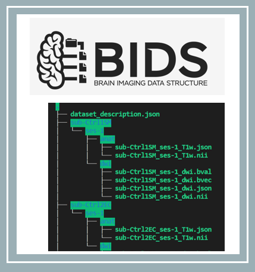

# mwmaclean-BHS2020
This project is part of the Brainhack School 2020

Team contributors: Michèle MacLean & Brainhack School members

## Summary 

Hello! I'm currently a PhD student in Cognitive Neuroscience at l'Université de Montréal. My main focus is to study cortical visual impairment using MRI techniques. Damage to the primary visual areas can result in clinical blindness and prompt a cascade of dynamical structural and functional alterations of the neural networks at both the cortical and subcortical level. Following this damage, individuals can sometimes preserve the ability to non consciously process visual information in their blind field, a striking phenomenon know as blindsight. My fascination resides in understanding how the brain can process visual information without conscious awareness.

The overall goal of the current project is to use the tools to organize, analyze and visualize MRI data learned during the BrainHack Summer School.  

 

## Project definition 

### Background

This project will explore the steps for analyzing diffusion magnetic resonance imaging data starting from the raw data all the way to data visualization. The long term goal is to investigate the consequences of a primary visual cortex lesion on cerebral reorganization using both diffusion MRI and/or resting state functional connectivity. For this, I will use previously acquired data from l'Unité de Neuroimagerie Fonctionnelle in Montréal. 

The following objectives represent the next planned steps: 
The first steps will be to try to 1) organize the MRI data in a BIDS friendly format and then 2) preprocess the data. Then, I plan to explore 3) analyzing diffusion MRI (i.e. dwi tracking) and 4) perform data visualization.

### Tools 
This project will rely on the following:
* GitHub for creating a repository & assembling all the resources.
* Bash terminal
* Visual studio code
* BIDS as a standard to organize the neuroimaging data
* Python 
* Docker container to run preprocessing pipeline and basic tracking
* DIPY for preprocessing and basic tracking of diffusion weighted images (DWI)
* Jupyter Notebook to document the process and for data visualization
* Data visualization tools (e.g. Nilearn, Plotly, Numpy, Matplotlib, Seaborn).

### Data 
MRI data was acquired with a high resolution 3 Tesla scanner (Siemens Trio system) and consists of a preliminary data set of 5 subjects, including 1 individual with cortical visual impairment with blindsight and 4 neurotypical controls. For each participant, raw structural MRI, resting state functional connectivity, fMRI and diffusion MRI data is avaiblable. 

Given the time course of the summer school, after the initial preprocessing of the data, I will first focus on working with the diffusion MRI data. I believe this data set will allow to first become familiarized with the new neuroimaging tools and create anaylses scripts. When I eventually acquire more data during the rest of my PhD, I will hopefully be able to modify the scripts and work on a larger data set.

The figure above is an example of an individual with cortical visual impairment to give you an idea of the type of data, where A) shows a T1-weighted anatomical scan with three different slice views showing the primary visual cortex removal in the left hemisphere and the destruction of the primary visual areas (V1) and B) the individual's visual field showing a symmetric loss across both eyes leading to a complete contralateral visual loss in the right visual field.

As the dataset is not yet open access, feel free to send me a message if you have any questions and I'll be happy to answer!

## Deliverables
For the project:
At the end, we hope to have:
* The current markdown document, completed and revised.
* Organization of MRI data into BIDS format
* The diffusion MRI data preprocessed.
* Basic tracking performed on the preprocessed diffusion MRI data with an output of streamlines & connectivity matrices.
* Data visualization within a jupyter notebook using plotly, nilearn and matplotlib.
* Requirements.txt for the Jupyter notebook

For the course:
* **Week 1 Deliverable:**  [Assessement](https://github.com/mwmaclean/MacLean-M-QLSC612)
* **Week 2 Deliverable:** [README file](https://github.com/brainhack-school2020/mwmaclean-BHS2020/blob/master/README.md)
* **Week 3 Deliverable:** [Data visualization](https://github.com/brainhack-school2020/mwmaclean-BHS2020/tree/master/data_visualization)
* **Week 4 Deliverable:** [Presentation](https://github.com/brainhack-school2020/mwmaclean-BHS2020/tree/master/presentation)

### Method
1. **Data Organization/Management.**
* Convert dicoms to a BIDS friendly dataset. [This tutorial](http://reproducibility.stanford.edu/bids-tutorial-series-part-1b/) served as a guideline.

2. **Preprocessing diffusion MRI data.**
* Running a preprocessing pipeline using [this docker image](https://hub.docker.com/r/gkiar/dwipreproc_fsl-5.0.11_minified)
* [This python script](https://github.com/gkiar/stability/blob/master/code/preprocessing/preprocessing_pipeline.py) was used within the docker container.
* Labels from Klein & Tourville (2012) were applied.

3. **Creating a seed mask.** 
* [This python scricpt](https://github.com/gkiar/mask2boundary) was used to create a seed mask for each participant.

4. **Tracking of diffusion weighted images (DWI)**
* [This docker image](https://hub.docker.com/r/gkiar/dipy_tracking) was used to perform tracking of the diffusion data.
* [This python script](https://github.com/gkiar/stability/blob/master/code/tractography/dipy/dipy_tracking.py) was used within the container. This script is based off of [this tutorial](https://dipy.org/documentation/1.0.0./examples_built/tracking_introduction_eudx/) for DIPY tracking.

5. **Data visualization**
* Data visualization was performed within a Jupyter notebook using Plotly, Nilearn, Matplotlib, Seaborn and more (see visualization examples below).

### Data visualization
1. Connectivity matrix; 2. Connectome (2D); 3. Connectome projected on a 3D glass brain: 

* The jupyter notebook version of all three figures is interactive with a drop-down for each subject.
* The connectivity matrices (.mat files) used for the data visualization can be found [here](https://github.com/brainhack-school2020/mwmaclean-BHS2020/tree/master/data_visualization/connectivity_matrices)
* The figures (saved as .png or .html) for each subject can also be found [here](https://github.com/brainhack-school2020/mwmaclean-BHS2020/tree/master/images) 

### Progress overview

This project was initiated by Michèle MacLean May 19th 2020 as part of the BrainHack School. 
Organization of MRI data into BIDS format, preprocessing and basic tracking of the data is complete as well as data visualization for the deliverable for week 3. Feedback is welcome!

### Tools I learned during this project
* Bash terminal
* GitHub
* Visual Studio Code
* How to implement BIDS 
* Python scripts 
* Docker container 
* DIPY for preprocessing and basic tracking of diffusion weighted images (DWI)
* Jupyter Notebook 
* Nilearn, plotly & matplotlib for data visualization

 
## Conclusion and acknowledgement
Thanks to the wonderful BrainHack School for this experience as well as all the ressources provided!
Special thanks to my instructors Noor, Benjamin and Greg! 

## References
* Kiar, G. <gkiar.github.io>. (2020). Dipy Tracking and Connectome Generation (Version v0.4.0). Zenodo. http://doi.org/10.5281/zenodo.3699595
* Kiar, G. (2019). Using FSL from FMRIB at Oxford- BIDS App - FSL Diffusion Preprocessing (Version 5.0.9). Zenodo. http://doi.org/10.5281/zenodo.2566455
* Klein, A. and J. Tourville (2012). 101 labeled brain images and a consistent human cortical labeling protocol. Frontiers in Neuroscience 6: 171.https://doi.org/10.3389/fnins.2012.00171